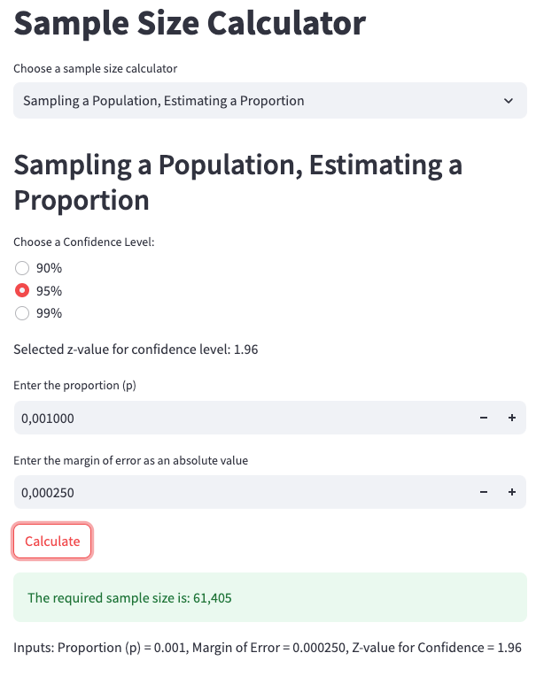
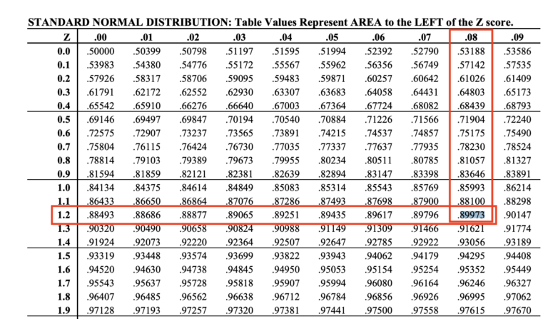

# Sample Size Calculator

This repository contains the code used to create the **Sample Size Calculator** application, accessible here:

👉 [**CALCULATOR CLICK HERE**](http://18.231.252.63:8080/)  

Built in **Python**, this calculator is deployed on **Google Cloud Run** (serverless) using a **Docker container** and **Streamlit**.

---

## Overview

The Sample Size Calculator addresses common scenarios for AB testing and statistical analyses, such as:
- Comparing two means
- Comparing two proportions
- Estimating a single mean
- Estimating a single proportion

The underlying mathematical formulas for these calculations are clearly documented here:

🧮 [**Sample Size Formulas**](./docs/README.md)

Additionally, you can review the Python implementation of these formulas in:

🐍 [`streamlit_sample_size_calculator.py`](./streamlit_sample_size_calculator.py)

For full details and insights on sample size calculations, see the comprehensive documentation in the Towards Data Science article:

📖 [**Mastering Sample Size Calculations @ Towards Data Science**](https://towardsdatascience.com/mastering-sample-size-calculations-75afcddd2ff3)

---

## Application Screenshots and Use Cases

| Screenshot | Description |
|------------|-------------|
|  | **App Screenshot 1:** Calculating the sample size for comparing two means. |
|  | **App Screenshot 2:** Calculating the sample size for comparing two means with Delta = 1. |
|  | **App Screenshot 3:** Calculating the sample size for comparing two proportions. |
|  | **App Screenshot 4:** Calculating the sample size for estimating the mean when sampling a population. |

> **Note:** Images can be viewed at full resolution by visiting the [`docs/results_scripts`](./docs/results_scripts/) folder.

---

## Z-Score Tables for Statistical Power

This repository also provides reference images to find critical Z-scores for different statistical power levels:

| Z-Score Table | Description |
|---------------|-------------|
|  | **Z-Score for 80% Statistical Power** |
|  | **Z-Score for 90% Statistical Power** |

> **Note:** Full-sized images are available at [`docs/z-score-tables`](./docs/z-score-tables).

---

## SQL Scripts Documentation

Detailed documentation and results generated by the SQL scripts used in this project are available in:

📑 [`src/article_scripts` README](./src/article_scripts/README.md)

---

## Project Structure

The repository follows a clear structure to enhance ease of navigation:


```
├── Dockerfile
├── docs
│ └── results_scripts
├── monte-carlo-experiment
│ ├── data
│ └── docs
├── src
│ └── article_scripts
├── streamlit_sample_size_calculator.py
└── requirements.txt
```


---

### Dependencies

All dependencies and their exact versions are listed in [`requirements.txt`](./requirements.txt).  
To install them, run:

```bash
pip install -r requirements.txt
```
