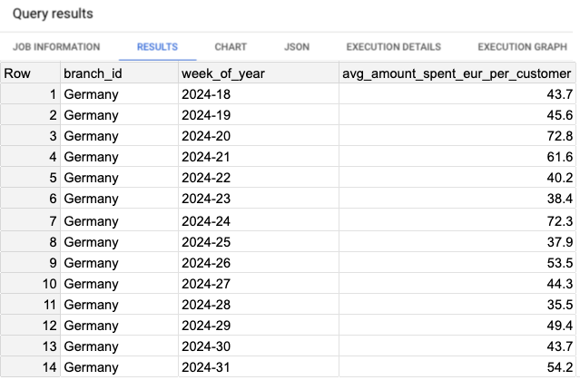
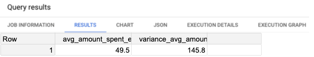
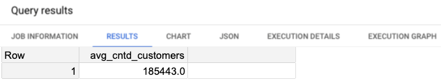
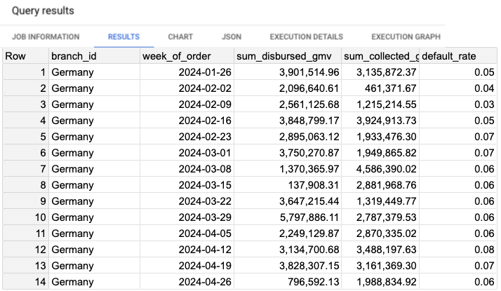

# Article Scripts and Result Visualizations

This directory contains SQL scripts used for generating critical metrics, along with their corresponding visual results from execution.

| SQL Script | Result Visualization |
|------------|----------------------|
| [`script_1_success_metric.sql`](./script_1_success_metric.sql) |  |
| [`script_2_compute_var_success_metric.sql`](./script_2_compute_var_success_metric.sql) |  |
| [`script_3_calculate_avg_weekly_volume.sql`](./script_3_calculate_avg_weekly_volume.sql) |  |
| [`script_4_retrieve_default_rate.sql`](./script_4_retrieve_default_rate.sql) |  |

> **Note:**  
> The images above are previews. To view the detailed, full-resolution images, please navigate directly to the [results_scripts directory](../../docs/results_scripts/).

## Explanation

- **SQL Scripts**: Generate specific datasets critical for analysis.
- **Result Visualizations**: Provide immediate insights into script outcomes.

---

🔙 [**Return to Main README.md**](../../README.md)
